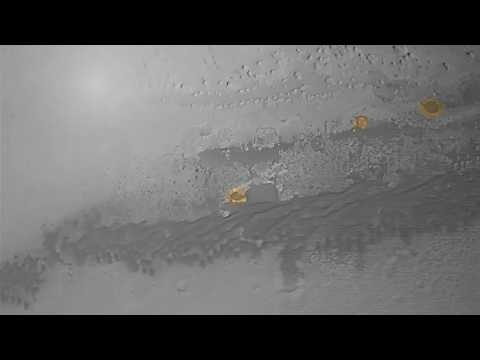
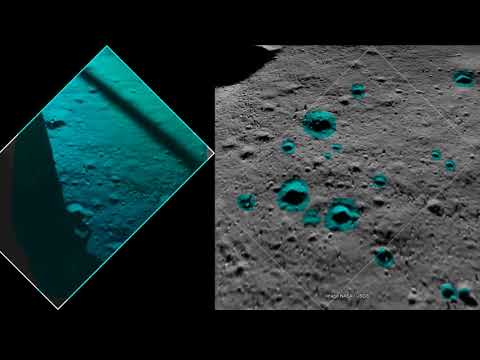

# Mars Crater Detection and Segmentation with MaskRCNN


#### Dependencies 
Tested On Windows 10 pro PC with GPU
```
conda install tensorflow-gpu
conda install keras
```

Detection of craters on planetary surface is very crucial for the better understanding of planet topography. It is also important for the selection of landing sites of various lander mission, path planning for rover missions. This project is about application of deep learning method for detection and semantic segmentation of craters in an image. Model trained using transfer learning on pretrained MaskRCNN model. Overall project can be devided into four parts as follow:-    


1. [Data Preparation](https://github.com/sandipanrakshit34/Mars-Crater-Detection-and-Segmentation-with-MaskRCNN)

2. [Data Inspection](inspect_crater_data.ipynb)

3. [Training](train.ipynb)

4. [Testing](inspect_crater_model.ipynb)

With splash.py the trained model was tested on video, although it was only trained with Mars data, learned model able to detect craters on the lunar surface as well.

Mars                       |  Moon
:-------------------------:|:-------------------------:
[]() |                                           []()

#### Data Collection and Training-Validation data preparation 

Image data collected from the [sources](Dataset-Sources) and annotated with [VIA](http://www.robots.ox.ac.uk/~vgg/software/via/via.html) tool to get json file. Which looks like:- 


The Labeled dataset can be downloaded from [dropbox](https://www.dropbox.com/scl/fi/w7fptm1xrg4g7l7r71rzk/mask_rcnn_crater_new.h5?rlkey=cuws7n87zk1cox6whe6zsxvon&st=glnwexit&dl=0).
Dataset directory looks like:-
```bash

├── train
│   ├── img1.jpg
|   ├── :
|   ├── imgn.jpg
│   └── via_region_data.json
└── val
    ├── img.jpg
    ├── :
    ├── imgq.jpg
    └── via_region_data.json
```
train and val folder should be inside datasets directory(which is place at root directory)

Trained model mask_rcnn_crater_new.h5 [dropbox](https://www.dropbox.com/scl/fi/0hk0m92ru6rthsgiqnluy/mask_rcnn_crater_new.h5?rlkey=z2i4ijotx5prjcv6kf4ld5l57&st=9p14gadi&dl=0)

Dataset Sources:

1. [High Resolution Imaging Science Experiment](https://www.uahirise.org/)
2. [Mars Science](https://mars.nasa.gov/multimedia/images/)
3. [ASU](https://jmars.mars.asu.edu/)
4. [USGS](https://webgis2.wr.usgs.gov/Mars_Global_GIS/)

